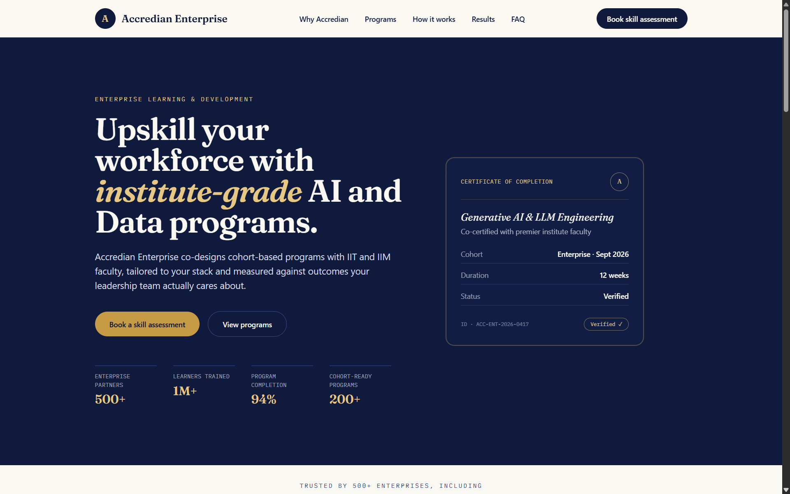
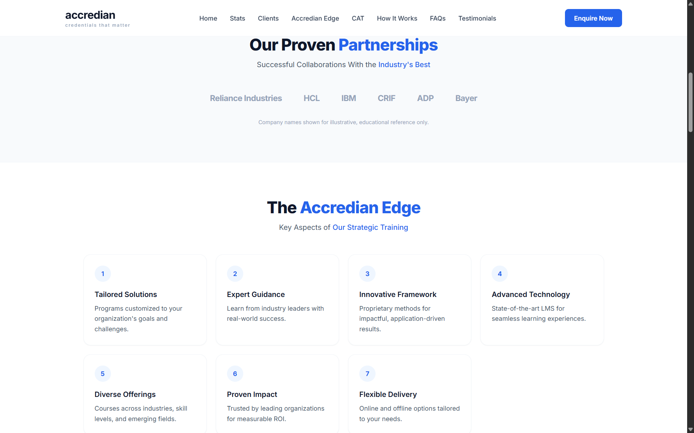
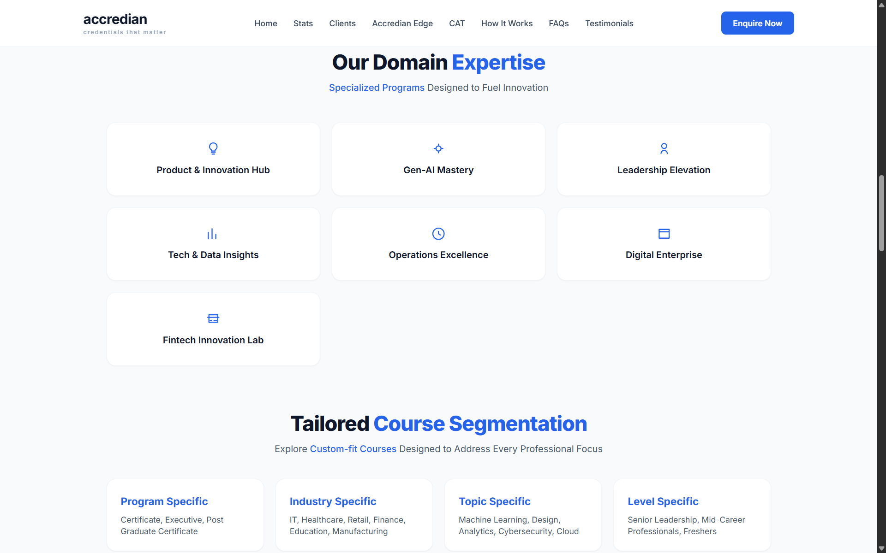
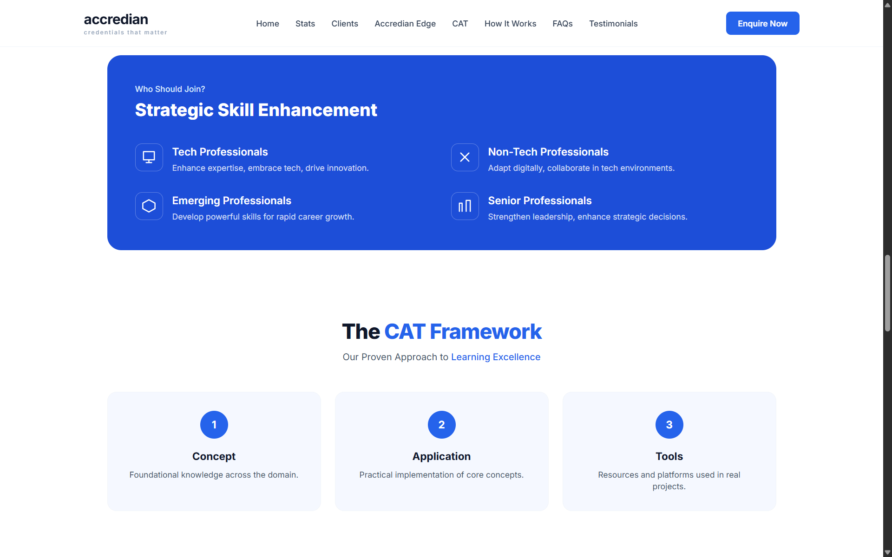
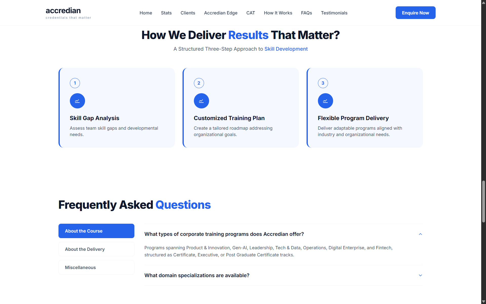
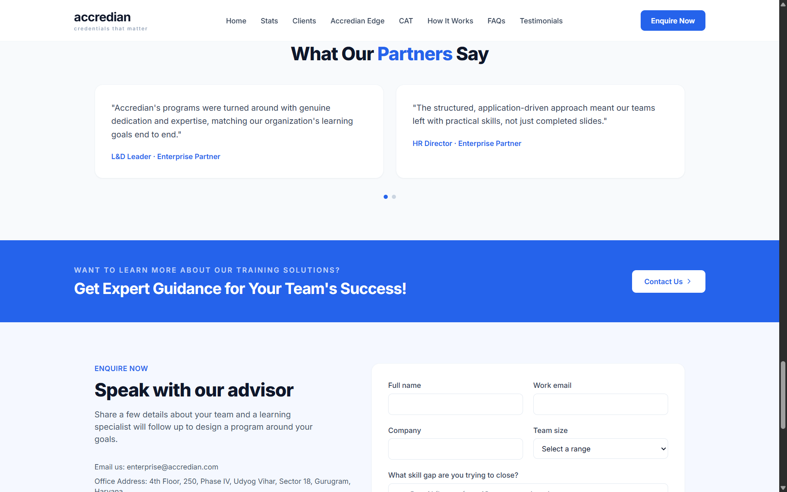
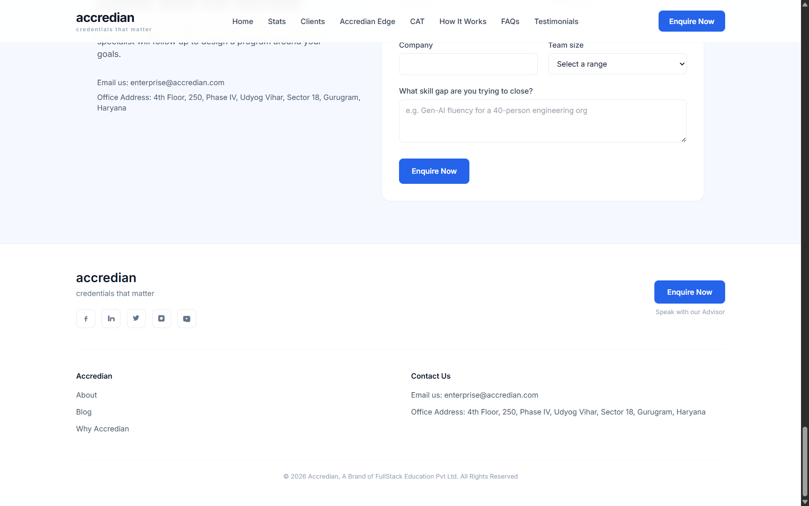

# Accredian Enterprise

Accredian Enterprise is a partial clone of the Accredian Enterprise landing page, built with Next.js for enterprise B2B upskilling programs. It features a fully responsive marketing site with a custom design system, a functional lead-capture form backed by a real API route, and a component library structured for reuse and easy content management.

## Features

* Responsive landing page across mobile, tablet, and desktop breakpoints
* Custom design system with a dedicated color, type, and layout token set
* Reusable, typed section components decoupled from content
* Functional lead capture form with server-side validation and API integration
* Accessible interaction patterns including keyboard focus states and ARIA attributes on interactive elements
* Centralized content layer for editing copy without touching layout code

## Overview










## Tech Stack

### Frontend

* Next.js 14, App Router
* TypeScript
* Tailwind CSS
* next/font, Fraunces, Inter, IBM Plex Mono

### Backend

* Next.js Route Handlers
* Node.js runtime, Vercel serverless functions

## Project Structure

## Project Structure

```text
Accredian-Enterprise
│
├── app/
│   ├── api
│   │   └── leads
│   │       └── route.ts
│   ├── globals.css
│   ├── icon.svg
│   ├── layout.tsx
│   └── page.tsx
│
├── components/
│   ├── AccredianEdge.tsx
│   ├── CATFramework.tsx
│   ├── CTABanner.tsx
│   ├── Clients.tsx
│   ├── DomainExpertise.tsx
│   ├── FAQ.tsx
│   ├── Footer.tsx
│   ├── Hero.tsx
│   ├── HowItWorks.tsx
│   ├── LeadForm.tsx
│   ├── Navbar.tsx
│   ├── Stats.tsx
│   ├── Testimonials.tsx
│   └── WhoShouldJoin.tsx
│
├── lib/
│   └── data.ts
│
├── docs/
├── .eslintrc.json
├── .gitignore
├── next-env.d.ts
├── next.config.mjs
├── package.json
├── package-lock.json
├── postcss.config.mjs
├── tailwind.config.ts
├── tsconfig.json
└── README.md
```

## Installation

```bash
git clone https://github.com/samoff04/Accredian-Enterprise.git
cd Accredian-Enterprise
npm install
npm run dev
```

The app runs on `http://localhost:3000`. No environment variables are required.

For a production build:

```bash
npm run build
npm start
```

## API Endpoints

### Leads

| Method | Endpoint     | Description                          |
| ------ | ------------ | ------------------------------------- |
| POST   | /api/leads    | Submits a new lead, server-validated  |
| GET    | /api/leads    | Returns captured leads for the session |


## Author

Samarth Varshney